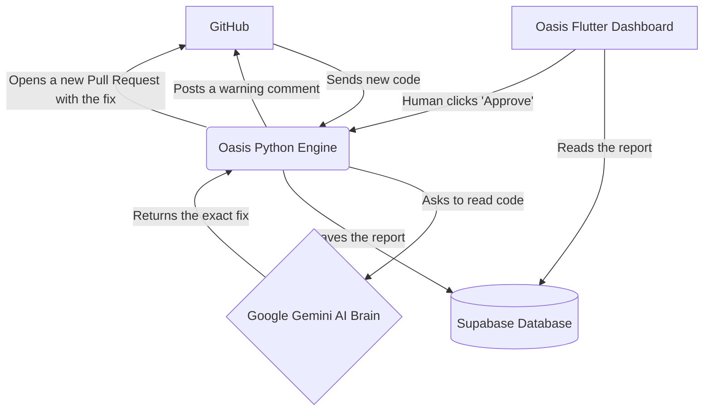

# Oasis: The Smart Code Security Guard

Oasis is an automated security assistant for software teams. It watches over your code, finds mistakes before they cause problems, and uses AI to suggest the exact fix. But most importantly, it never pushes changes to your real project without you saying yes first — a human always gets the final say.

## The Problem

When teams build software quickly, they sometimes make mistakes. They might accidentally leave a password in the code, or write a line of code that hackers can easily break into.

* Traditional security tools just give you a massive list of confusing errors and expect you to figure out how to fix them.
* Fully automated AI tools try to fix the code by themselves, which can accidentally break the software because the AI doesn't understand the big picture.

## The Oasis Solution (Human-In-The-Loop)

Oasis gives you the best of both worlds.

You connect Oasis to your GitHub account once. From that moment on, every time a developer tries to add new code to a connected project (this is called opening a Pull Request), Oasis instantly reads it. If it finds a security risk, it acts like a senior engineer: it points out the exact problem and writes the correct code to fix it.

Instead of forcing the change, Oasis puts the fix into a **Waiting Room** (the Approvals Queue). A real human reviews the fix on a clean dashboard, clicks "Approve," and only then does Oasis take the next step — and even then, it doesn't sneak the fix into your project. It opens a brand new, separate Pull Request containing just the fix, so a human still has to look at it on GitHub and click the final "Merge" button themselves.

---

## How It Works (The Journey of a Bug)

1. **Connecting:** You install the Oasis app on your GitHub account and pick which repositories it's allowed to watch. From then on, any repository you add or remove in GitHub is picked up by Oasis automatically — no manual typing required.
2. **The Mistake:** A developer finishes writing some code and opens a Pull Request on one of your connected repositories.
3. **The Alarm:** GitHub instantly rings a digital doorbell to wake up the Oasis Engine.
4. **The AI Brain:** Oasis downloads the new code and hands it to a smart AI (Google Gemini). The AI reads the code, spots the security flaw, and writes the replacement code.
5. **The Waiting Room:** The AI's report is saved to the database, and Oasis posts a friendly comment on the original GitHub Pull Request warning the developer.
6. **The Human Check:** A manager opens the Oasis Dashboard. They see the mistake, they see the AI's suggested fix, and they click "Approve."
7. **The Auto-Fix:** Oasis creates a new branch, commits the fix to it, and opens a brand new Pull Request containing just that fix. It also leaves a comment on the original Pull Request pointing to it.
8. **The Final Word:** A human opens that new Pull Request on GitHub and decides whether to merge it. Oasis never merges anything by itself.

---

## Architecture Diagram

Here is a simple map of how the different parts of Oasis talk to each other.

### The Five Main Pieces:

* **The Code Host (GitHub):** Where your software lives. Oasis connects to it as an official GitHub App.
* **The Engine (Python):** The hardworking middleman that catches the code, talks to the AI, organizes the data, and — once approved — opens the fix as a new Pull Request.
* **The AI Brain (Google Gemini):** Reads the code and writes the actual fix.
* **The Filing Cabinet (Supabase):** A secure cloud database that remembers every mistake, every fix, and every user.
* **The Dashboard (Flutter):** The website where human managers go to read the reports and approve the fixes.

---

## The Technology We Used

We used simple, modern tools to build Oasis. Here is what we chose and why:

* **Frontend (Flutter):** We used this to build the dashboard. One codebase gives us a fast, clean website that works well on both desktop and mobile screens.
* **Backend (Python / FastAPI):** We used Python because it is great for handling data and AI. It runs quietly in the background, listening for GitHub to tell it that new code is ready to read, and it's also the piece that talks to GitHub to open the fix as a new Pull Request.
* **Database (Supabase):** A modern filing cabinet built on top of a real Postgres database. It also handles user logins for us, and keeps each user's data locked away from everyone else's.
* **AI Engine (Google Gemini):** Gemini is incredibly good at reading computer code. We gave it strict instructions to act like a professional security guard and to always answer in a structured, predictable format so nothing gets lost in translation.
* **GitHub App:** Instead of asking users to type in repository names by hand, Oasis registers itself as a real, installable GitHub App. When you install it, GitHub tells Oasis exactly which repositories you picked, and keeps that list updated automatically if you add or remove repositories later.

---

## Key Features

* **Automatic Repository Tracking:** Install the Oasis GitHub App once, pick your repositories, and Oasis keeps watching them — add or remove a repo in GitHub, and Oasis knows immediately. No manual typing.
* **Strict Human Approval:** The AI never touches your live project without a human clicking "Approve" first.
* **Real Auto-Fix, With a Safety Net:** Once approved, Oasis doesn't just show you a code snippet to copy — it actually opens a real Pull Request with the fix already written. But it still can't merge it. That last click is always yours.
* **Secure Logins:** Users can log in with an email and password, or sign in instantly using their existing GitHub account.
* **Private Workspaces:** Users only see the security reports for their own connected repositories. You cannot see my findings, and I cannot see yours.
* **Full Audit Trail:** Every finding, every approval, and every auto-generated fix is recorded, so you always know what happened and when.

---

## Getting Started (For Developers)

If you want to run Oasis on your own computer, you need to set up three things: the database, the engine, and the dashboard — plus register a GitHub App so Oasis can talk to GitHub on your behalf.

### 1. Set Up the Database

1. Create a free account on Supabase.
2. Open the SQL Editor and paste in the provided `create_schema.sql` file. This builds the empty filing cabinets for Users, Repositories, Findings, and Activity.
3. Save your Project URL and your API keys — you'll need them in the next step.

### 2. Register a GitHub App

1. On GitHub, create a new GitHub App under your account's Developer Settings.
2. Give it permission to read Pull Requests, read and write repository contents, and read and write Issues (this is how it posts comments and opens fix Pull Requests).
3. Generate a private key and note down your App's ID and URL slug — these are Oasis's "ID card" for talking to GitHub.

### 3. Start the Engine (Backend)

1. Open the Python folder.
2. Create a `.env` file and add your secret passwords: your Supabase keys, your Gemini API key, and the GitHub App details from Step 2.
3. Install everything with `pip install -r requirements.txt`.
4. Run the engine using `uvicorn main:app --reload`.
5. If you're testing locally (not a real server), connect the engine to the internet using a tunneling tool, and point your GitHub App's webhook address at it.

### 4. Start the Dashboard (Frontend)

1. Open the Flutter folder.
2. Create a `.env` file and add your public Supabase URL and public key, plus the address of your running backend.
3. Install the required packages with `flutter pub get`.
4. Start the website by typing `flutter run -d chrome`.
5. Open your web browser, log in, connect your GitHub account, and watch the magic happen!

---

## What Oasis Doesn't Do (Yet)

Being upfront about the edges of the current version:

* Oasis does not stream updates to your screen live — you'll refresh or navigate to see the newest findings, rather than watching them appear in real time.
* Oasis cannot merge a Pull Request for you. It stops right before that step, on purpose.
* Sign-in currently supports email/password and GitHub — not other providers like Google, yet.
